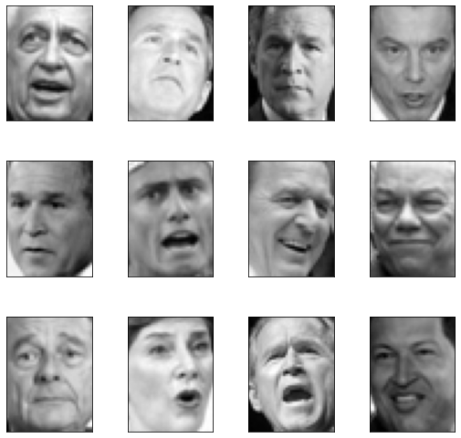
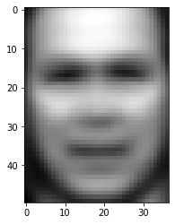
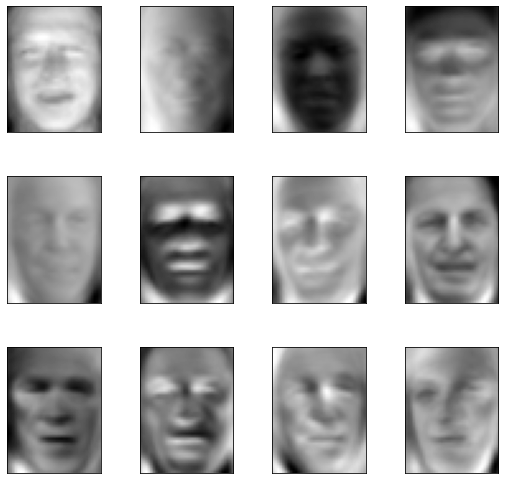
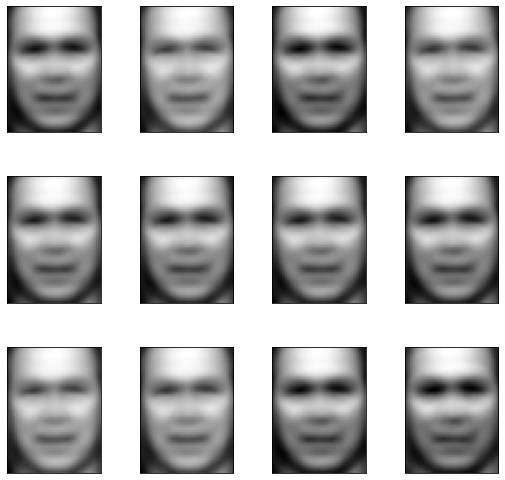
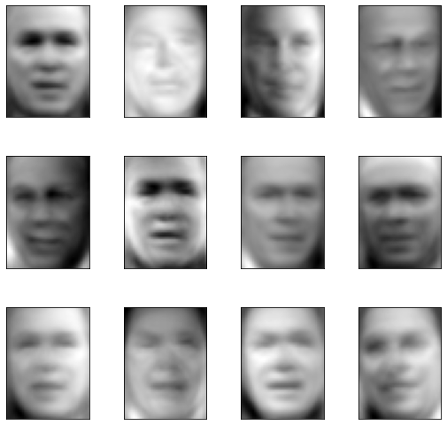
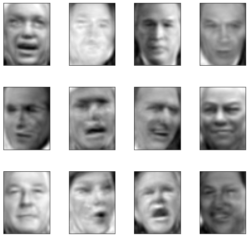
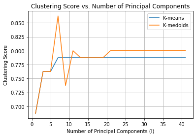

# Image-Reconstruction-with-PCA

This repository contains Python code for image reconstruction using Principal Component Analysis (PCA). The primary focus is on applying PCA, clustering and reconstructing images from the Labeled Faces in the Wild (LFW) dataset. **This repository is mainly for educational purposes!**

## Files: 
- cluster.py: Contains the implementation of data points, clusters, and cluster sets. It includes functions for calculating purity, centroids, medoids, and implementing the k-means and k-medoids clustering algorithms.
- faces.py: Main script for exploring the LFW dataset, running PCA, reconstructing images, and performing clustering on face images.
- util.py: Utility functions for handling the LFW dataset, including fetching data, displaying images, performing PCA, and reconstructing images from PCA components.

## Requirements: 
- Python 3.x
- NumPy
- Matplotlib
- SciPy
- scikit-learn

## Results

The first thing to do with any new dataset is to look at it! Here are the first 12 images of the original set: 

  
   
  <i>First 12 photos from the original dataset</i>

As expected the "average" face is a blend of all facial features. It has a generalized facial structure and has a smooth and less detailed appearance: 

  
   
  <i>Average Face</i>

### PCA

The first few principle components capture the highest variability in the dataset. Looking at these eigenfaces it seems like the first few represent the variation in lighting, head direction and facial expression such as smiles. The top 12 "eigenface"s are:

  
   
  <i>Top 12 eigenfaces</i>

### Image Reconstruction

After applying PCA and projecting the original data into the lower-dimensional space, we can reconstruct high-dimensional images out of lower dimensional ones. Reconstruction results improve as the number of principal components used gets bigger. 

Let's look at the first 12 images reconstructed with 1, 10, 100 and 1288 components respectively: 

   
  <i>Reconstructed with 1 PC</i>

   
 <i>Reconstructed with 10 PCs</i>

   
  <i>Reconstructed with 100 PCs</i>

   
  <i>Reconstructed with 1288 PCs</i>

### Clustering Output

To see the effect of lower-dimensional representations on clustering performance, we apply k-means and k-medoids algorithms on reconstructed images. For simplicity let's only consider two classes (two individuals) and select only 40 images of each. Then compute the principal components for the entire image dataset and project the newly generated dataset of the two individuals into a lower dimension (varying the number of principal components), and compute the scores of each clustering algorithm. Here is a plot of the clustering score versus the number of components for each clustering algorithm: 

  

Note that as the number of principle components increases,the clustering algorithms capture more nuanced features, leading to higher scores. However; athere is a plateau in score improvement beyond 5-10 principal components, indicating that additional components do not contribute meaningful variation to distinguish the classes further. Also notice that K-medoids perform better than k-means in this region since k-medoids is more robust to outliers.

You can use clustering to determine who look alike and who don't! Here we are doing so by finding the min and max clustering scores for each unique pair of individuals. I found Donald Rumsfeld and John Ashcroft bear a close resemblance, whereas Jean Chrétien and Serena Williams exhibit the most dissimilarity!

## Acknowledgments: 
- The starter code for clustering and PCA was adapted from Dr. Jessica Wu (HMC)
- The Labeled Faces in the Wild (LFW) dataset was provided by The University of Massachusetts.

